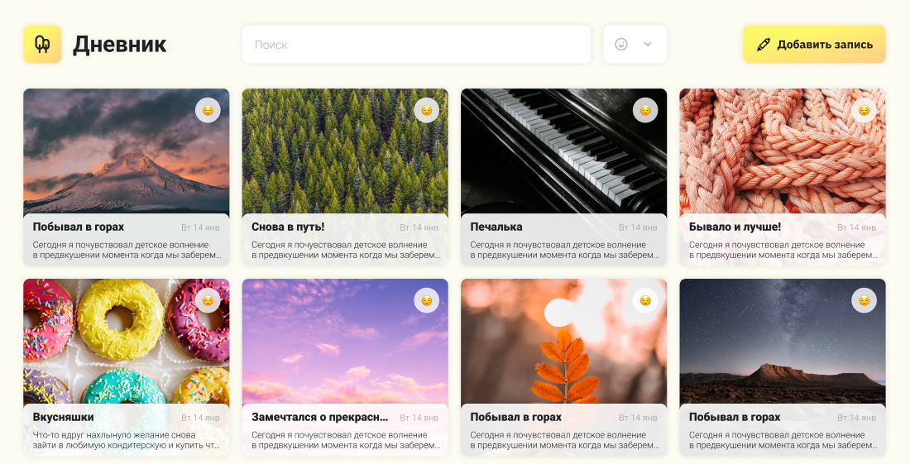

[](https://codeclimate.com/github/zapupenec/diary_app/maintainability)

[EN](https://github.com/zapupenec/diary_app) | RU

# [Приложение дневник](https://diary-app-self.vercel.app)
Приложение для заметок с возможностью добавления, редактирования, удаления и поиска. Поиск изображений для заметок с помощью API.



Создано на основе проекта учебной стажировки в
<a href="https://preax.ru" target="_blank" rel="noreferrer">

</a>

**Начальные условия**: стек
<a href="https://developer.mozilla.org/en-US/docs/Glossary/html5" target="_blank" rel="noreferrer">

</a>
<a href="https://www.w3.org/TR/CSS/#css" target="_blank" rel="noreferrer">

</a>
<a href="https://developer.mozilla.org/en-US/docs/Web/JavaScript" target="_blank" rel="noreferrer">

</a>
<a href="https://react.dev" target="_blank" rel="noreferrer">

</a>
без дополнительных библиотек.

Добавил
<a href="https://www.typescriptlang.org" target="_blank" rel="noreferrer">

</a>
к начальным условиям для практики.

## Установка для разработки

Во время разработки использовалась Node.js v20.4.0.

Для работы с API понадобиться секретный ключ. Зарегистрируйтесь на [unsplash.com](https://unsplash.com) и создайте свой ключ.

Скопируйте репозиторий локально.

```
git clone https://github.com/zapupenec/diary_app.git
```

Установите зависимости.

```
make install
```

В корневой папке создайте файл `.env` и запишите ваш ключ.

```
// contents of .env

REACT_APP_API_KEY = 'your-secret-api-key'
```

Запустите приложения в режиме разработки.

```
make start
```

Откройте [http://localhost:3000](http://localhost:3000), чтобы просмотреть его в браузере.

Команда для сборки продакшена.

```
make build
```
